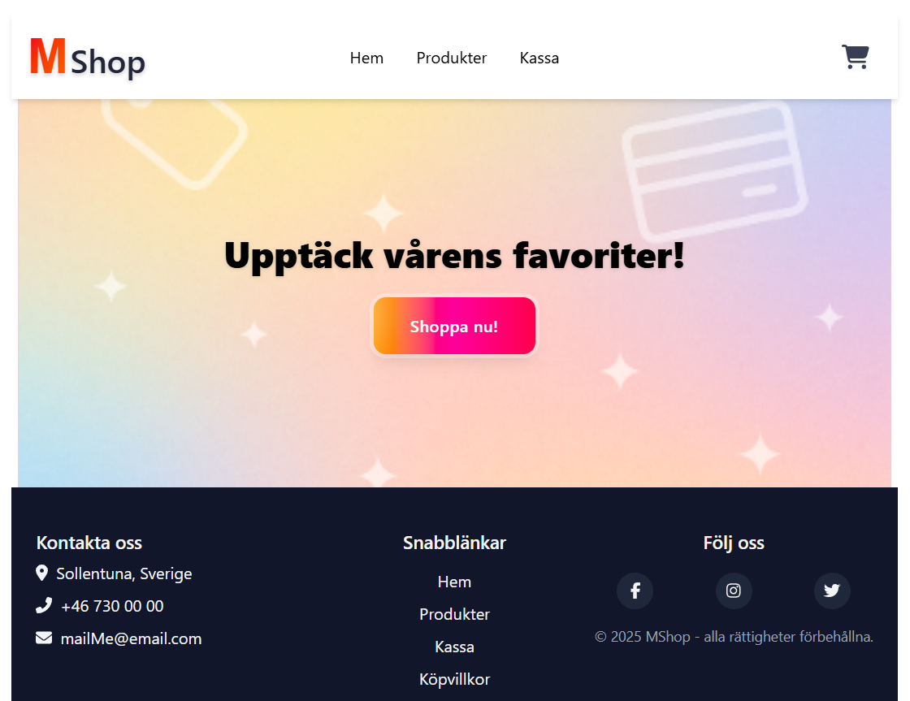

# MShop – React-baserad Webshop

En enkel men komplett e-handels-demo byggd för kursens projektarbete.

## Demo



## 📦 Innehåll

1. [Projektbeskrivning](#projektbeskrivning)
2. [Funktioner](#funktioner)
3. [Teknisk stack](#teknisk-stack)
4. [Installation & körning](#installation--körning)
5. [Mappstruktur](#mappstruktur)
6. [Vidare utveckling](#vidare-utveckling)

---

## Projektbeskrivning

MShop demonstrerar hur man:

- hämtar **produkter** från **DummyJSON-API:t**
- hanterar **kundvagn** med global state (React Context + `useReducer`)
- genomför ett **checkout-flöde** med validering och order­bekräftelse
- håller layouten responsiv med **Tailwind CSS**

Projektet uppfyller samtliga funktions- och teknik­krav i uppgifts­beskrivningen.

---

## Funktioner

| Sida              | Beskrivning                                             |
| ----------------- | ------------------------------------------------------- |
| **/ (Home)**      | kort välkomst-/hero-sektion                             |
| **/product-list** | grid-lista från `https://dummyjson.com/products`        |
| **/products/:id** | produktsida med bild, pris, beskrivning + “lägg i korg” |
| **Cart**          | öka/minska/ta bort artiklar, totalsumma i realtid       |
| **/checkout**     | kontakt- & leverans­uppgifter, summering, validering    |
| **/confirmation** | order­kvittens, rensar kundvagn                         |

---

## Teknisk stack

| Del             | Val                                     |
| --------------- | --------------------------------------- |
| **Ramverk**     | React (via [Vite](https://vitejs.dev/)) |
| **Routing**     | React Router 6                          |
| **State**       | React Context + `useReducer`            |
| **HTTP**        | `fetch` (inbyggt)                       |
| **Stilar**      | Tailwind CSS                            |
| **Ikoner**      | FontAwesome                             |
| **Animationer** | Framer Motion (Cart Drawer)             |

---

## Installation & körning

```bash
# 1. Klona repo
git clone https://github.com/<ditt-användarnamn>/mshop.git
cd mshop

# 2. Installera beroenden
npm install         # eller pnpm / yarn

# 3. Starta utvecklingsservern
npm run dev         # http://localhost:5173

# 4. Bygg för produktion
npm run build
npm run preview     # validera den färdiga bygget lokalt
```

## Licens

MIT
